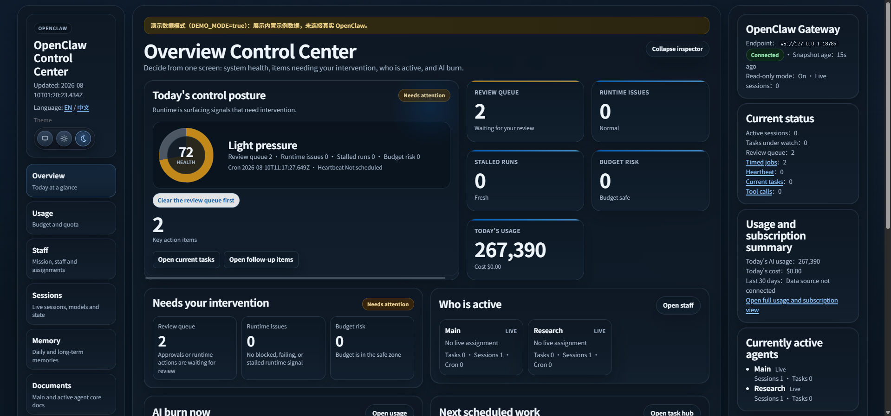

# OpenClaw Control Center



> A security-first, local-first control center for OpenClaw — see at a glance whether your system is healthy, who is working, which tasks are stuck, and what today costs.


Language: **English** | [中文](README.md)

---

## Highlights

- 8 dashboard sections: Overview / Usage / Staff / Sessions / Memory / Docs / Tasks / Settings
- Overview: health score, key action items, who is active, AI burn now, next scheduled work, runtime checkpoint
- Sessions: live session cards (state, model, tokens in-out, last activity) + OpenClaw Gateway status card
- Usage and cost: subscription snapshot, budget progress, today burn (correct local-timezone day grouping)
- Safe by default: read-only mode, local token login wall, protected APIs fail closed with 403 when no token is configured
- Experience: light/dark themes (skeuomorphic circular switcher), dark-mode contrast and white-edge fixes, zh/en language, mobile-friendly
- Engineering: Gzip, stale-while-revalidate snapshots, DEMO preview mode, single-file bundle

## Quick start

```bash
npm install
npm run start        # start UI -> http://127.0.0.1:4310
```

No OpenClaw? Preview the UI with sample data:

```bash
npm run dev:demo     # DEMO_MODE=true, renders all panels with built-in data
```

Single-file distribution (no tsx / npm install at runtime):

```bash
npm run build:single # produces dist/control-center.js (~0.9 MB)
npm run start:single # node dist/control-center.js
```

## Dashboard sections

| Section | What you see |
|---|---|
| Overview | Today posture, health, action items, who is active, AI burn, schedule |
| Usage | Subscription snapshot, budget progress, today/cumulative, token and cost breakdown |
| Staff | Staff, roles and assignments |
| Sessions | Live sessions, models, state, Gateway health |
| Memory | Daily and long-term memories |
| Docs | Core docs of main and active agents |
| Tasks | Board, schedule and activity |
| Settings | Safety and data links |

## Security model

- READONLY_MODE=true (default): read-only, no monitor artifacts written to disk
- LOCAL_TOKEN_AUTH_REQUIRED=true (default): protected routes require a local token
- When LOCAL_API_TOKEN is unset, protected APIs return 403 (fail-closed)
- High-risk mutations (approval execution, import) are disabled by default
- Listens on 127.0.0.1 only

## Environment variables

| Variable | Default | Description |
|---|---|---|
| GATEWAY_URL | ws://127.0.0.1:18789 | OpenClaw Gateway endpoint (status display) |
| OPENCLAW_HOME / CODEX_HOME | ~/.openclaw / ~/.codex | Data directory overrides |
| READONLY_MODE | true | Read-only mode |
| LOCAL_TOKEN_AUTH_REQUIRED | true | Require local token auth |
| LOCAL_API_TOKEN | empty | Local API token (protected APIs fail closed when unset) |
| DEMO_MODE | false | Render built-in sample data |
| UI_MODE / UI_PORT | false / 4310 | UI mode and port |

Full list in .env.example and docs/LOCAL_SETUP.en.md.

## Project layout

```
src/
  clients/     OpenClaw CLI/file/sample-data clients (demo-client)
  adapters/    readonly snapshot composition
  runtime/     usage, tasks, snapshot cache, audit, etc.
  ui/          HTTP server + SSR dashboard (server.ts)
  mappers/     upstream payloads to typed summaries
test/          node:test suite (105 tests)
scripts/       ops / self-heal / smoke scripts
```

## Common commands

| Command | Description |
|---|---|
| npm run start | Start the UI (same as UI_MODE=true) |
| npm run dev | Dev mode (smoke monitor run) |
| npm run dev:demo | DEMO preview (no OpenClaw) |
| npm run dev:continuous | Resident monitor mode |
| npm run build:single / start:single | Single-file bundle / run |
| npm test | Run tests |
| npm run smoke:ui | UI end-to-end smoke |

## Docs

- docs/LOCAL_SETUP.en.md — setup and configuration
- docs/RUNBOOK.md — runbook (safety, live mode, performance baselines)
- docs/ARCHITECTURE.md — architecture
- docs/PROJECT_STRUCTURE.md — layering
- docs/SOURCE_ATTRIBUTION.md — attribution

## Credits

Forked from TianyiDataScience/openclaw-control-center; the original product direction, base control-center concept and core runtime model belong to the upstream author.
